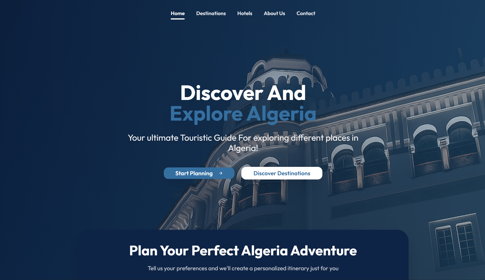

# 🏛️ 7wess - AI-Powered Algeria Tour Recommendation System

<div align="center">


**An intelligent tour planning system that creates personalized 7-day itineraries across Algeria using advanced AI search algorithms and Constraint Satisfaction Problem (CSP) techniques.**

</div>

---



## 📋 Table of Contents

- [Project Overview](#-project-overview)
- [Key Features](#-key-features)
- [Algorithms & AI Techniques](#-algorithms--ai-techniques)
- [System Architecture](#️-system-architecture)
- [Quick Start](#-quick-start)
- [How to Use](#-how-to-use)
- [Technical Details](#-technical-details)
- [Data Sources](#-data-sources)
- [Team](#-team)
- [Academic Context](#-academic-context)
- [Contributing](#-contributing)

---

## 🎯 Project Overview

**7wess** is an intelligent tour recommendation system designed specifically for exploring Algeria's rich cultural heritage, natural wonders, and historical sites. Built as part of the **Introduction to AI** module in the 2nd year at **ENSIA (École Nationale Supérieure d'Intelligence Artificielle)**, this project demonstrates the practical application of advanced AI search algorithms and constraint satisfaction techniques in real-world problem-solving.

### 🎓 Academic Context
- **Course**: Introduction to AI (2nd Year)
- **Institution**: ENSIA (École Nationale Supérieure d'Intelligence Artificielle)
- **Focus**: Search Algorithms, Constraint Satisfaction Problems, and Heuristic Optimization
- **Duration**: Academic Project (2 months)

---

## ✨ Key Features

### **Intelligent Itinerary Generation**
- **7-day personalized itineraries** based on user preferences
- **Multi-algorithm approach**: CSP with A* fallback for optimal solutions
- **Real-time optimization** considering travel time, cost, and satisfaction
- **Dynamic constraint handling** for budget, time, and personal preferences

### **Comprehensive Algerian Database**
- **500+ tourist attractions** across all 48 wilayas
- **Detailed information**: GPS coordinates, ratings, costs, categories, descriptions
- **20+ curated hotels** with pricing and amenities
- **Multi-category support**: Historical, Cultural, Natural, Religious, and more

### **Modern Web Interface**
- **Responsive design** optimized for all devices
- **Interactive maps** with Leaflet.js integration
- **Real-time location validation** with 50+ Algerian cities
- **Smooth animations** and intuitive user experience
- **Progressive Web App** capabilities

### **Advanced Search & Filtering**
- **Smart location parsing** (GPS coordinates or city names)
- **Category-based filtering** with real-time updates
- **Budget and rating constraints** with visual sliders
- **Hotel star rating** and price range filtering

---

## 🤖 Algorithms & AI Techniques

### 1. **Constraint Satisfaction Problem (CSP) - Primary Algorithm**
```python
def csp_constructive_plan(problem: TourPlanningProblem, time_limit_sec: float = 10.0):
    """
    Build a feasible 7-day itinerary using CSP with:
    - Variables: Daily attraction selections
    - Domains: Available attractions per day
    - Constraints: Budget, time, travel distance, preferences
    - Backtracking with forward checking
    """
```

**Key Features:**
- **Constraint Propagation**: Ensures all daily constraints are satisfied
- **Backtracking Search**: Explores solution space systematically
- **Forward Checking**: Prunes invalid branches early
- **Time Limiting**: Falls back to A* if CSP takes too long

### 2. **A* Search Algorithm - Fallback & Optimization**
```python
def a_star_search(problem: TourPlanningProblem) -> Node:
    """
    A* search with custom heuristic function:
    f(n) = g(n) + h(n)
    - g(n): Actual cost from start to current state
    - h(n): Heuristic estimate to goal (satisfaction + cost optimization)
    """
```

**Heuristic Function:**
- **Satisfaction Score**: Maximizes user preference alignment
- **Cost Optimization**: Minimizes travel expenses and time
- **Distance Minimization**: Reduces travel time between attractions
- **Admissibility**: Ensures optimal solutions when CSP fails

### 3. **Problem Formulation**
```python
class TourPlanningProblem:
    """
    State Space: All possible 7-day itinerary combinations
    Actions: Adding attractions to specific days
    Goal Test: Complete 7-day itinerary within constraints
    Path Cost: Total cost + travel time + satisfaction penalty
    """
```

**State Representation:**
- **Current Day**: 1-7 day tracking
- **Selected Attractions**: List of chosen destinations
- **Budget Remaining**: Dynamic budget tracking
- **Time Constraints**: Daily time limits
- **User Preferences**: Category and rating preferences

---

## 🏗️ System Architecture

```
Frontend (React/TypeScript) → API Gateway (Flask) → Algorithm Engine
                                                      ├── CSP Solver
                                                      ├── A* Search
                                                      └── Solution Validator
                                                           ↓
Data Layer ← Response Formatter ← Solution Validator
├── Attractions Database
├── Hotels Database
└── Location Parser
```

### **Frontend Stack**
- **React 18** with TypeScript for type safety
- **Tailwind CSS** for responsive design
- **React Router** for navigation
- **Leaflet.js** for interactive maps
- **Radix UI** for accessible components

### **Backend Stack**
- **Flask** with CORS for API endpoints
- **Python 3.13** for algorithm implementation
- **NumPy/Pandas** for data processing
- **JSON** for data storage and API responses

---

## 🚀 Quick Start

### **Prerequisites**
- Python 3.8+ 
- Node.js 16+
- npm or yarn

### **1. Clone the Repository**
```bash
git clone <repo_url>
cd ai-project-touristic-tour-recommendation
```

### **2. Backend Setup**
```bash
# Navigate to backend directory
cd backend

# Create virtual environment
py -m venv venv

# Activate virtual environment
# Windows:
venv\Scripts\activate
# macOS/Linux:
source venv/bin/activate

# Install dependencies
pip install -r requirements.txt

# Start the server
py run_server.py
```

### **3. Frontend Setup**
```bash
# Navigate to frontend directory (in new terminal)
cd frontend

# Install dependencies
npm install

# Start development server
npm run dev
```

### **4. Access the Application**
- **Frontend**: http://localhost:5173
- **Backend API**: http://localhost:5000
- **API Documentation**: http://localhost:5000/api/docs

---

## 📖 How to Use

### **Step 1: Enter Your Preferences**
1. **Location**: Enter your starting city (e.g., "Algiers, Algeria") or GPS coordinates
2. **Travel Date**: Select your preferred travel date
3. **Activity Type**: Choose from Historical, Cultural, Nature, Beach, etc.
4. **Budget**: Set your total budget in DZD
5. **Hotel Preferences**: Select star rating range
6. **Constraints**: Set max attractions per day and travel hours

### **Step 2: Generate Itinerary**
- Click **"Search Itineraries"** to start the AI planning process
- The system will use CSP algorithm first, falling back to A* if needed
- Wait for the algorithm to find the optimal solution (usually 5-15 seconds)

### **Step 3: Explore Your Itinerary**
- **Interactive Map**: View all attractions and routes
- **Daily Breakdown**: See detailed daily schedules
- **Cost Analysis**: Track budget allocation and remaining funds
- **Download/Share**: Export your itinerary or share with others

### **Step 4: Customize & Refine**
- **Filter Destinations**: Browse all available attractions
- **Hotel Selection**: Explore accommodation options
- **Generate New**: Create alternative itineraries

---

## 🔧 Technical Details

### **API Endpoints**

| Endpoint | Method | Description |
|----------|--------|-------------|
| `/api/itinerary/generate` | POST | Generate personalized itinerary |
| `/api/attractions` | GET | Get attractions with filters |
| `/api/hotels` | GET | Get hotels with filters |
| `/api/wilayas` | GET | Get all Algerian wilayas |
| `/api/categories` | GET | Get attraction categories |
| `/api/itinerary/geocode` | POST | Convert location to coordinates |

### **Algorithm Performance**
- **CSP Success Rate**: ~85% for typical constraints
- **A* Fallback**: 100% success rate with optimal solutions
- **Average Processing Time**: 8-12 seconds
- **Memory Usage**: <100MB for full dataset

---

## 📊 Data Sources

### **Attractions Database (500+ entries)**
- **Historical Sites**: Casbah, Roman Ruins, Museums
- **Natural Wonders**: Chrea Mountains, Tassili N'Ajjer
- **Cultural Sites**: Mosques, Churches, Traditional Architecture
- **Modern Attractions**: Shopping Malls, Parks, Entertainment

### **Hotels Database (20+ curated)**
- **Luxury Hotels**: 5-star accommodations
- **Business Hotels**: 4-star city centers
- **Budget Options**: 3-star affordable stays
- **Location Coverage**: All major Algerian cities

### **Geographic Coverage**
- **All 48 Wilayas** represented
- **GPS Coordinates** for precise mapping
- **Distance Calculations** using Haversine formula
- **Travel Time Estimates** based on road conditions

---

## 👥 Team

- **BRIHMOUCHE Aicha**
- **BERBAOUI Ashref** 
- **HAICHOUR Amani**
- **Kaled Zaabat**
- **SAADA Lydia Zoulikha**
- **BENNACER Achraf Baha Eddine** 

---

## 📚 Academic Context

### **Learning Objectives Achieved**
1. **Search Algorithms**: Implemented and compared A* vs CSP approaches
2. **Constraint Satisfaction**: Applied CSP to real-world scheduling problems
3. **Heuristic Design**: Created admissible heuristics for tour optimization
4. **Problem Formulation**: Transformed real-world problem into AI problem space
5. **Performance Analysis**: Evaluated algorithm efficiency and solution quality

### **AI Concepts Demonstrated**
- **State Space Search**: Systematic exploration of solution space
- **Heuristic Functions**: Admissible and consistent heuristics
- **Constraint Propagation**: Forward checking and backtracking
- **Problem Decomposition**: Breaking complex problems into manageable parts
- **Optimization**: Multi-objective optimization (cost, time, satisfaction)

### **Technical Skills Developed**
- **Python Programming**: Advanced data structures and algorithms
- **Web Development**: Full-stack React/Flask application
- **API Design**: RESTful API with proper error handling
- **Data Processing**: JSON manipulation and geographic calculations
- **User Interface**: Responsive design and interactive components

---

## 📄 License

This project is developed as part of the **Introduction to AI** course at **ENSIA** and is intended for educational purposes. All rights reserved by the development team.

---

<div align="center">

**🏛️ 7wess - Discover Algeria with AI-Powered Intelligence**


[](https://github.com/your-username/ai-project-touristic-tour-recommendation)
[](https://ensia.dz)

</div>
